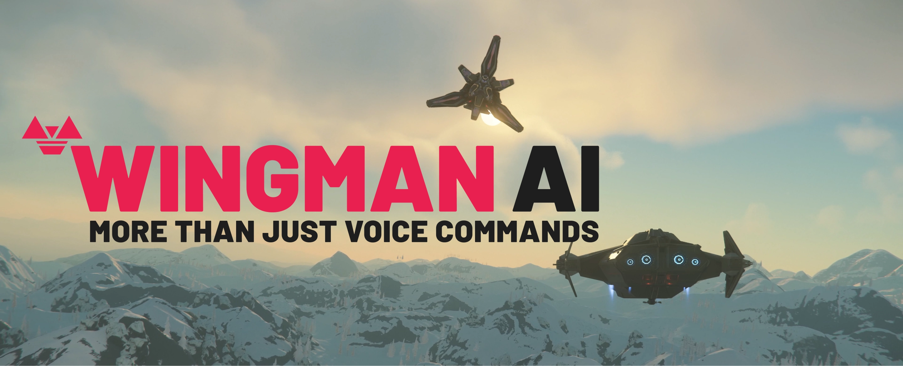
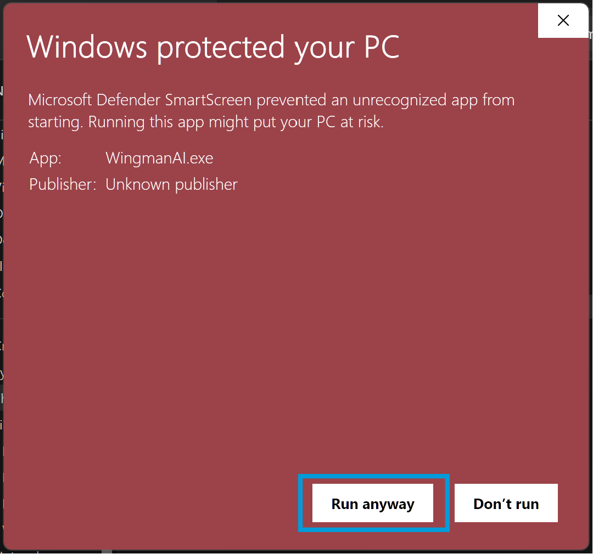
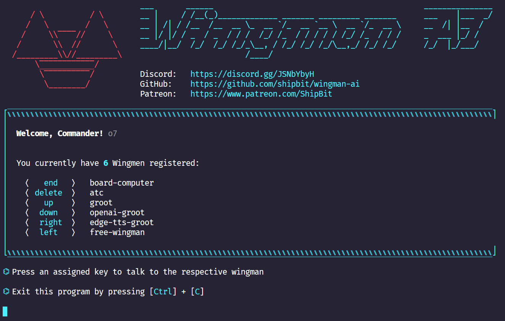

# Wingman AI

Wingman AI allows you to use your voice to talk to various AI providers and LLMs, process your conversations, and ultimately trigger actions such as pressing buttons or reading answers. Our _Wingmen_ are like characters and your interface to this world, and you can easily control their behavior and characteristics, even if you're not a developer.

AI is complex and it scares people. It's also not 'just ChatGPT'. We want to make it as easy as possible for you to get started. That's what _Wingman AI_ is all about. It's a **framework** that allows you to build your own Wingmen and use them in your games and programs.

The idea is simple, but the possibilities are endless. For example, you could:

- **Role play** with an AI while playing for more immersion. Have air traffic control (ATC) in _Star Citizen_ or _Flight Simulator_. Talk to Shadowheart in Baldur's Gate 3 and have her respond in her own (cloned) voice.
- Get live data such as trade information, build guides, or wiki content and have it read to you in-game by a _character_ and voice you control.
- Execute keystrokes in games/applications and create complex macros. Trigger them in natural conversations with **no need for exact phrases.** The AI understands the context of your dialog and is quite _smart_ in recognizing your intent. Say _"It's raining! I can't see a thing!"_ and have it trigger a command you simply named _WipeVisors_.
- Automate tasks on your computer
- improve accessibility
- ... and much more

## Is this a "Star Citizen" thing?

**No, it is not!** We presented an early prototype of Wingman AI in _Star Citizen_ on YouTube, which caused a lot of excitement and interest in the community. Star Citizen is a great game, we love it and it has a lot of interesting use-cases for Wingmen but it's not the only game we play and not the core of our interest. We're also not affiliated with CIG or _Star Citizen_ in any way.

Wingman AI is an external, universal tool that you can run alongside any game or program. As such, it does not currently interact directly with _Star Citizen_ or any other game, other than its ability to trigger system-wide keystrokes, which of course can have an effect on the game.
However, if you find a way to interact with a game, either through an API or by reading the game's memory, you could - in theory - use it to directly trigger in-game actions or feed your models with live data. This is **not** the focus of Wingman AI, though.

## Who is this for?

The project is intended for two different groups of users:

### Developers

If you're a developer, you can just clone the repository and start building your own Wingmen. We try to keep the codebase as open and hackable as possible, with lots of hooks and extension points. The base classes you'll need are well documented, and we're happy to help you get started. We also provide a [development guide](#develop-with-wingman-ai) to help you witht the setup. Wingman is currently 100% written in Python.

### Gamers & other interested people

If you're not a developer, you can start with pre-built Wingmen from us or from the community and [reconfigure](#configure-wingmen) them to your needs. We take a very _configuration-heavy_ approach, and while it might be a bit overwhelming and confusing to edit our (very identation-sensitive) YAML config file right now, we're working on a more user-friendly UI to make it easier for you in the future.

## Is this free? What about these API keys? Do I need a subscription?

Wingman AI is free and open source, but the AI providers you'll be using are not.

### OpenAI

Our Wingmen use OpenAI's APIs and they charge by usage. That means: You don't pay a flat subscription fee, but rather for each call you make to their APIs. You can find more information about the APIs and their [pricing](https://openai.com/pricing) on the [OpenAI website](https://beta.openai.com/docs/introduction). You will need to create your API key:

- Navigate to [openai.com](https://openai.com/) and click on "Try ChatGPT".
- Choose "Sign-Up" and create an account.
- (if you get an error, go back to [openai.com](https://openai.com/))
- Click "Login".
- Fill in your personal information and verify your phone number.
- **Select API**. You don't need ChatGPT Plus to use Wingman AI.
- (Go to "Settings > Limits" and set a low soft and hard "usage limit" for your API key. We recommend this to avoid unexpected costs. $5 is fine for now)
- Go to "Billing" and add a payment method.
- Select "API Key" from the menu on the left and create one. Copy it! If you forget it, you can always create a new one.

**Our sample Wingmen use the following OpenAI APIs:**.

- Whisper for transcription
- Any GPT model you configure, e.g. `gpt-3.5-turbo-1106`. More complex Wingmen examples require a more powerful model like `gpt-4-1106-preview` to work correctly.
- TTS / Text-to-Speech

We are also working on a Vision API implementation, but it's not ready yet.

### ElevenLabs

You don't have to use [ElevenLabs](https://elevenlabs.io/) as TTS provider, but their voices are great. You can also clone your own with less than 5 minutes of sample audio, e.g. your friend, an actor or a recording of an NPC in your game.

They have a free tier with a limited number of characters generated per month so you can try it out first. You can find more information on their [pricing page](https://elevenlabs.io/pricing).

Signing up is very similar to OpenAI: Create your account, set up your payment method, and create an API key.

### Edge TTS

Microsoft Edge TTS is actually free and you don't need an API key to use it. However, it's not as "good" as the others in terms of quality. Their voices are split by language, so the same voice can't speak different languages - you have to choose a new voice for the new language instead. Wingman does this for you, but it's still "Windows TTS" and not as good as the other providers.

### Is this possible for free? I have my own local LLM running

Yes, it is. If you're a developer.

We're also working on a "Free Wingman" that uses only free APIs and services. But it's not ready yet.

## Installing Wingman AI

### Windows

- Download the latest version from [wingman-ai.com](https://www.wingman-ai.com).
- Extract it to a new directory of your choice. **DO NOT** extract it to `C:\Program Files` or you'll need admin priviledges to execute it. Pick a user directory, your Desktop, Downloads etc instead. Extract all the files, not just the `.exe`.
- Run `WingmanAI.exe` from that directory.
- There will be a Windows SmartScreen security warning (see screenshots below) because our package is currently unsigned. Sorry about that, we're working on it. Just click `More Info` and then `Run anyway` to start the application.
- Follow the instructions and enter your API key(s).
- Try talking to our default/example Wingmen. It's **push to talk**, so keep the activation key pressed while talking. Release the key when you're done talking. We're already working on a voice activation feature, but it's not ready yet.
  - _DELETE_: Board computer
  - _END_: ATC
  - _UP_: StarHead

You can ask them anything you want, so just try something like: _"Hey, what can you do for me?"_. You can change their activation keys and other settings in the `config.yaml` file in your Wingman directory.

**If you're a developer**, we always recommend to [run from source](#develop-with-wingman-ai). This way you can pull our latest changes and debug the code.

### MacOS

Wingman **does** run on MacOS. While we don't have a precompiled package for it yet but you can [run it from source](#develop-with-wingman-ai).

Also note that we have to rely on [PyAutoGUI](https://github.com/asweigart/pyautogui) for key presses on MacOS, which does not work well in many games. Developing on MacOS is perfectly fine, though.

## Running Wingman AI

// TODO when GUI is ready

<!-- Wait for the welcome screen to appear. It will show you the available wingmen and their activation keys.

You can have multiple wingmen active at the same time. Each one is bound to a different activation key. When you see the welcome screen, you're ready to go. Press and hold a specific activation key while talking to your wingman (push-to-talk). Release the key when you're done.

The Wingman AI console doesn't need to be focused, so you can leave it running in the background while you play. You will see your wingman's replies and other helpful output in the console.

To exit Wingman AI, simply press `CTRL+C` in the console or close the console window. -->

## Who are these Wingmen?

Our default Wingmen serve as examples and starting points for your own Wingmen, and you can easily reconfigure them in the `config.yaml` file. You can also add your own Wingmen to this config file.

### board-computer & atc

Our first two Wingmen are based on OpenAI's APIs. The basic process is as follows:

- Your speech is transcribed by the **Whisper API**.
- The transcript is then sent as text to the **GPT-4 Turbo API**, which responds with a text.
- The response is then read out to you by the **OpenAI Text-to-Speech API**.

Before you ask: You can change all of these providers in the `config.yaml` file. We're not affiliated with any of them, and we're not paid by them.

Talking to a Wingman is like chatting with ChatGPT. This means that you can customize their behavior by giving them a `context` (or `system`) prompt as starting point for your conversation. You can also just tell them how to behave and they will remember that during your conversation. ATC and board-computer use very different prompts, so they behave very differently. See `config.yaml` for more information.

The magic happens when you configure _commands_ or key bindings. GPT will then try to match your request with the configured commands and execute them for you. It will automatically choose the best matching command based only on its name, so make sure you give it a good one (e.g. `RequestLandingPermission`).

More information about the API can be found in the [OpenAI API documentation](https://beta.openai.com/docs/introduction).

### StarHead

StarHead is where it gets really interesting. This Wingman is tailored to _Star Citizen_ and uses the [StarHead API](https://star-head.de) to enrich your gaming experience with external data. It is a showcase of how to build specialized Wingmen for specific use-cases and scenarios. Simply ask StarHead for the best trade route, and it will prompt you for your ship, location, and budget. It will then call the StarHead API and read the result back to you.

Like all of our OpenAI Wingmen, it will remember the conversation history and you can ask follow-up questions. For example, you can ask what the starting point of the route, or what the next stop is. You can also ask for the best trade route from a different location or with a different ship.

StarHead is a community project that aims to provide a platform for _Star Citizen_ players to share their knowledge and experience. At the moment it is mainly focused on the trading aspect of _Star Citizen_. With a huge database of trade items, shop inventories and prices, it allows you to find the best trade routes and make the most profit. A large community of players is constantly working to keep the data up to date.

For updates and more information, visit the [StarHead website](https://star-head.de) or follow @KNEBEL on

- [Twitch](https://www.twitch.tv/knebeltv)
- [YouTube](https://www.youtube.com/@Knebel_DE)

## Configuring Wingman

This is the most complex part of Wingman AI right now, but we're working on a more user-friendly UI to make it easier for you. For now, you have to edit the [config.yaml](https://github.com/ShipBit/wingman-ai/blob/4c1168f8ef2a94dae8c4dbb55c30adbc6bf328c3/config.example.yaml) file directly. It is well-documented and contains a lot of examples and comments to help you get started.

It's very indentation-sensitive, so please be careful. We recommend using [VSCode](https://code.visualstudio.com/) with the [YAML extension](https://marketplace.visualstudio.com/items?itemName=redhat.vscode-yaml) to edit it.

Check out the [FAQ](FAQ.md) section for more information and documentation.

## Does it support my language?

Wingman supports all languages that OpenAI (or your configured AI provider) supports. Setting this up in Wingman is really easy:

Find the `context` setting in `config.xaml` for the Wingman you want to change.

Now add a simple sentence to the `context` prompt:

`Always answer in the language I'm using to talk to you.`

or something like:

`Always answer in Portuguese.`

The cool thing is that you can now trigger commands in the language of your choice without changing/translating the `name` of the commands - the AI will do that for you.

## Develop with Wingman AI

Are you ready to build your own Wingman or implement new features to the framework?

Please follow our guides to setup your dev environment:

- [Windows development](docs/develop-windows.md)
- [MacOS development](docs/develop-macos.md)

If you want to read some code first and understand how it all works, we recommend you start here (in this order):

- [config.yaml](https://github.com/ShipBit/wingman-ai/blob/4c1168f8ef2a94dae8c4dbb55c30adbc6bf328c3/config.example.yaml) - the configuration file
- [Wingman.py](https://github.com/ShipBit/wingman-ai/blob/4c1168f8ef2a94dae8c4dbb55c30adbc6bf328c3/wingmen/wingman.py) - the base class for all Wingmen
- [OpenAIWingman.py](https://github.com/ShipBit/wingman-ai/blob/4c1168f8ef2a94dae8c4dbb55c30adbc6bf328c3/wingmen/open_ai_wingman.py) - derived from Wingman
- [Tower.py](https://github.com/ShipBit/wingman-ai/blob/4c1168f8ef2a94dae8c4dbb55c30adbc6bf328c3/services/tower.py) - the factory that creates Wingmen

If you're planning to develop a major feature or new integration, please contact us on [Discord](https://discord.com/invite/k8tTBar3gZ) first and let us know what you're up to. We'll be happy to help you get started and make sure your work isn't wasted because we're already working on something similar.

## Our Patreons & Early Access Testers

Thank you so much for your support. We really appreciate it!

This list will inevitably remain incomplete. If you miss your name here, please let us know in [Discord](https://discord.com/invite/k8tTBar3gZ) or via [Patreon](https://www.patreon.com/ShipBit).

### Commanders

To our greatest supporters we say: `o7` Commanders!

- [**Rodney W. Harper aka Mactavious-Actual**](https://linktr.ee/rwhnc)
- **JayMatthew aka SawPsyder**

### Premium Donators

- [The Announcer](https://www.youtube.com/TheAnnouncerLive)
- [Weyland](https://robertsspaceindustries.com/orgs/corp)
- Morthius
- [Grobi](https://www.twitch.tv/grobitalks)
- Paradox

### Wingmen

[Ira Robinson aka Serene/BlindDadDoes](http://twitch.tv/BlindDadDoes), Zenith, DiVille, [Hiwada], Hades aka Architeutes, Raziel317, [CptToastey](https://www.twitch.tv/cpttoastey), NeyMR AKA EagleOne (Capt.Epic), a Bit Brutal, AlexeiX, [Dragon Aura](https://robertsspaceindustries.com/citizens/Dragon_Aura), Perry-x-Rhodan, DoublarThackery, SilentCid, Bytebool, Exaust A.K.A Nikoyevitch, Tycoon3000, N.T.G, Jolan97, Greywolfe, [JayMatthew](https://robertsspaceindustries.com/citizens/JayMatthew), [Dayel Ostraco aka BlakeSlate](https://dayelostra.co/), Nielsjuh01, Manasy, Sierra-Noble, Simon says aka Asgard, JillyTheSnail, [Admiral-Chaos aka Darth-Igi], The Don, Tristan Import Error, Munkey the pirate, Norman Pham aka meMidgety, [meenie](https://github.com/meenie), [Tilawan](https://github.com/jlaluces123), Mr. Moo42, Geekdomo, Jenpai, Blitz, [Aaron Sadler](https://github.com/AaronSadler687), [SleeperActual](https://vngd.net/), parawho, [HypeMunkey] https://robertsspaceindustries.com/citizens/HypeMunkey, Huniken, SuperTruck, [NozDog]

## Open Source Acknowledgements

Wingman makes use of other Open Source projects internally (without modifying them in any way).
We would like to thank their creators for their great work and contributions to the Open Source community, especially:

- [edge-tts](https://github.com/rany2/edge-tts) - GPL-3.0
- [openai](https://github.com/openai/openai-python) - Apache-2.0
- [openai-whisper](https://github.com/openai/whisper) - MIT
- [elevenlabslib](https://github.com/lugia19/elevenlabslib) - MIT, © 2018 The Python Packaging Authority
- [pydirectinput](https://github.com/learncodebygaming/pydirectinput) - MIT, © 2020 Ben Johnson
- [PyAutoGUI](https://github.com/asweigart/pyautogui) - BSD 3, © 2014 Al Sweigart
- [sounddevice](https://github.com/spatialaudio/python-sounddevice/) - MIT, © 2015-2023 Matthias Geier
- [soundfile](https://github.com/bastibe/python-soundfile) - BSD 3, © 2013 Bastian Bechtold
- [scipy](https://github.com/scipy/scipy) - BSD 3, © 2001-2002 Enthought, Inc. 2003-2023, SciPy Developers
- [numpy](https://github.com/numpy/numpy) - BSD 3, © 2005-2023, NumPy Developers
- [packaging](https://github.com/pypa/packaging) - Apache/BSD, © Donald Stufft and individual contributors
- [pyinstaller](https://github.com/pyinstaller/pyinstaller) - extended GPL 2.0, © 2010-2023, PyInstaller Development Team
- [faqtory](https://github.com/willmcgugan/faqtory) - MIT, © 2022 Will McGugan
