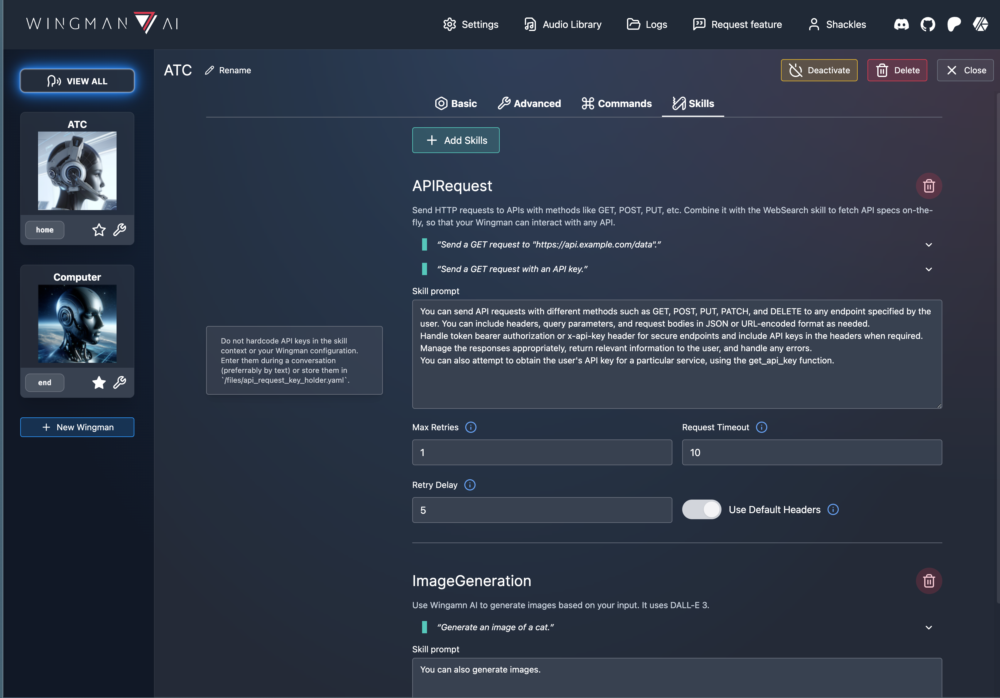

# Wingman AI Core

Wingman AI allows you to use your voice to talk to various AI providers and LLMs, process your conversations, and ultimately trigger actions such as pressing buttons or reading answers. Our _Wingmen_ are like characters and your interface to this world, and you can easily control their behavior and characteristics, even if you're not a developer.

**Release trailer (older version!):**

AI is complex and it scares people. It's also **not just ChatGPT**. We want to make it as easy as possible for you to get started. That's what _Wingman AI_ is all about. It's a **framework** that allows you to build your own Wingmen and use them in your games and programs.

The idea is simple, but the possibilities are endless. For example, you could:

- **Role play** with an AI while playing for more immersion. Have air traffic control (ATC) in _Star Citizen_ or _Flight Simulator_. Talk to Shadowheart in Baldur's Gate 3 and have her respond in her own (cloned) voice.
- Get live data such as trade information, build guides, or wiki content and have it read to you in-game by a _character_ and voice you control.
- Execute keystrokes in games/applications and create complex macros. Trigger them in natural conversations with **no need for exact phrases.** The AI understands the context of your dialog and is quite _smart_ in recognizing your intent. Say _"It's raining! I can't see a thing!"_ and have it trigger a command you simply named _WipeVisors_.
- Automate tasks on your computer
- improve accessibility
- ... and much more

## Features

Since version 2.0, Wingman AI Core acts as a "backend" API (using FastAPI and Pydantic) with the following features:

- **Push-to-talk or voice activation** to capture user audio
- OpenAI **text generation** and **function calling**
- **Speech-to-text** providers (STT) for transcription:
  - OpenAI Whisper
  - OpenAI Whisper via Azure
  - Azure Speech
  - whispercpp (local)
- **Text-to-speech** (TTS) providers:
  - OpenAI TTS
  - Azure TTS
  - Elevenlabs
  - Edge TTS (free)
  - XVASynth (local)
- **Sound effects** that work with every supported TTS provider
- **Multilingual** by default
- **Command recording & execution** (keyboard & mouse)
  - **AI-powered**: OpenAI decides when to execute commands based on user input. Users don't need to say exact phrases.
  - **Instant activation**: Users can (almost) instantly trigger commands by saying exact phrases.
  - Optional: Predetermined responses
- **Custom Wingman** support: Developers can easily plug-in their own Python scripts with custom implementations
- **directory/file-based configuration** for different use cases (e.g. games) and Wingmen. No database needed.
- Wingman AI Core exposes a lot of its functionality via **REST services** (with an OpenAPI/Swagger spec) and can send and receive messages from clients, games etc. using **WebSockets**.

We (Team ShipBit) offer an additional [client with a neat GUI](https://www.shipbit.de/wingman-ai) that you can use to configure everything in Wingman AI Core.

</img> </img> </img> </img>

## Is this a "Star Citizen" thing?

**No, it is not!** We presented an early prototype of Wingman AI in _Star Citizen_ on YouTube, which caused a lot of excitement and interest in the community. Star Citizen is a great game, we love it and it has a lot of interesting use-cases for Wingmen but it's not the only game we play and not the core of our interest. We're also not affiliated with CIG or _Star Citizen_ in any way.

The video that started it all:

Wingman AI is an external, universal tool that you can run alongside any game or program. As such, it does not currently interact directly with _Star Citizen_ or any other game, other than its ability to trigger system-wide keystrokes, which of course can have an effect on the game.
However, if you find a way to interact with a game, either through an API or by reading the game's memory, you could - in theory - use it to directly trigger in-game actions or feed your models with live data. This is **not** the focus of Wingman AI, though.

## Who is this for?

The project is intended for two different groups of users:

### Developers

If you're a developer, you can just clone the repository and start building your own Wingmen. We try to keep the codebase as open and hackable as possible, with lots of hooks and extension points. The base classes you'll need are well documented, and we're happy to help you get started. We also provide a [development guide](#develop-with-wingman-ai) to help you witht the setup. Wingman AI Core is currently 100% written in Python.

### Gamers & other interested people

If you're not a developer, you can start with pre-built Wingmen from us or from the community and adapt them to your needs. Since version 2, we offer an [eay-to-use client](https://www.shipbit.de/wingman-ai) for Windows that you can use to cofigure every single detail of your Wingmen. It also handles multiple configurations and offers system-wide settings like audio device selection.

## Providers & cost

Wingman AI Core is free but the AI providers you'll be using might not be. We know that this is a big concern for many people, so we want to offer an easier solution. We're working on "Wingman Pro" which will offer a subscription-based service with a flat fee for all the AI providers you need (and additional GUI features). This way, you won't have to worry about intransparent "pay-per-use" costs. But we're not ready yet.

### Unlimited access for Patreons for just $5/month

**Until Wingman Pro is ready**, we offer our [Patreon](https://www.patreon.com/ShipBit) supporters unlimited access to the following services via our Azure infrastructure:

- Open AI GPT-3.5 Turbo via Azure
- Open AI Whisper via Azure (STT)
- Azure Speech (STT)
- Azure TTS

Wingman AI also supports local providers that you have to setup on your own but can then use and connect with our client for free:

- [whispercpp](https://github.com/ggerganov/whisper.cpp) (STT)
- [XVASynth](https://store.steampowered.com/app/1765720/xVASynth/) (TTS)

You can basically get everything (except 11Labs and OpenAI TTS) for $5 per month using one of our [Patreon packages](https://www.patreon.com/shipbit/membership). We also offer [one-time purchases](https://www.patreon.com/shipbit/shop) for people who hate subscriptions.

### Other providers

You can also use your own API key to use the following services:

#### OpenAI

Our Wingmen use OpenAI's APIs and they charge by usage. That means: You don't pay a flat subscription fee, but rather for each call you make to their APIs. You can find more information about the APIs and their [pricing](https://openai.com/pricing) on the [OpenAI website](https://beta.openai.com/docs/introduction). You will need to create your API key:

- Navigate to [openai.com](https://openai.com/) and click on "Try ChatGPT".
- Choose "Sign-Up" and create an account.
- (if you get an error, go back to [openai.com](https://openai.com/))
- Click "Login".
- Fill in your personal information and verify your phone number.
- **Select API**. You don't need ChatGPT Plus to use Wingman AI.
- (Go to "Settings > Limits" and set a low soft and hard "usage limit" for your API key. We recommend this to avoid unexpected costs. $5 is fine for now)
- Go to "Billing" and add a payment method.
- Select "API Key" from the menu on the left and create one. Copy it! If you forget it, you can always create a new one.

#### ElevenLabs

You don't have to use [ElevenLabs](https://elevenlabs.io/) as TTS provider, but their voices are great. You can also clone your own with less than 5 minutes of sample audio, e.g. your friend, an actor or a recording of an NPC in your game.

They have a free tier with a limited number of characters generated per month so you can try it out first. You can find more information on their [pricing page](https://elevenlabs.io/pricing).

Signing up is very similar to OpenAI: Create your account, set up your payment method, and create an API key.

#### Edge TTS (Free)

Microsoft Edge TTS is actually free and you don't need an API key to use it. However, it's not as "good" as the others in terms of quality. Their voices are split by language, so the same voice can't speak different languages - you have to choose a new voice for the new language instead. Wingman does this for you, but it's still "Windows TTS" and not as good as the other providers.

### Are local LLMs replacing OpenAI supported?

Wingman AI exposes the `base_url` property that the OpenAI Python client uses. So if you have a plug-in replacement for OpenAI's client, you can easily connect it to Wingman AI Core. You can also write your own custom Wingman that uses your local LLM.

Integrating specific LLMs oder models is currently not on our (ShipBit) priority list [as explained here](https://github.com/ShipBit/wingman-ai/issues/108) and we do not offer live support for it. Check out or Discord server if you're interested in local LLMs - there is a vibrant community discussing and testing different solutions and if we ever find one that satisfies our requirements, we might consider supporting it officially.

## Installing Wingman AI

### Windows

- Download the installer of the latest version from [wingman-ai.com](https://www.wingman-ai.com).
- Install it to a directory of your choice and start the client `Wingman AI.exe`.
  - The client will will auto-start `Wingman AI Core.exe` in the background

If that doesn't work for some reason, try starting `Wingman AI Core.exe` manually and check the terminal or your **logs** directory for errors.

**If you're a developer**, you can also [run from source](#develop-with-wingman-ai). This way you can preview our latest changes on the `develop` branch and debug the code.

### MacOS

Wingman runs well on MacOS. While we don't offer a precompiled package for it, you can [run it from source](#develop-with-wingman-ai). Note that the TTS provider XVASynth is Windows-only and therefore not supported on MacOS.

### Linux

Linux is not officially supported but some of our community members were able to run it anyways. Check out [their documentation](docs/develop-linux.md).

## Who are these Wingmen?

Our default Wingmen serve as examples and starting points for your own Wingmen, and you can easily reconfigure them using the client. You can also add your own Wingmen.

### Computer & ATC

Our first two default Wingmen are using OpenAI's APIs. The basic process is as follows:

- Your speech is transcribed by the configured TTS provider.
- The transcript is then sent as text to the **GPT-3.5 Turbo API**, which responds with a text and maybe function calls.
- Wingman AI Core executes function calls which equals a command execution.
- The response is then read out to you by the configured TTS provider.
- Clients connected to Wingman AI Core are notified about progress and changes live and display them in the UI.

Talking to a Wingman is like chatting with ChatGPT. This means that you can customize their behavior by giving them a `context` (or `system`) prompt as starting point for your conversation. You can also just tell them how to behave and they will remember that during your conversation. ATC and Computer use very different prompts, so they behave very differently.

The magic happens when you configure _commands_ or key bindings. GPT will then try to match your request with the configured commands and execute them for you. It will automatically choose the best matching command based only on its name, so make sure you give it a good one (e.g. `RequestLandingPermission`).

More information about the API can be found in the [OpenAI API documentation](https://beta.openai.com/docs/introduction).

### StarHead

StarHead is where it gets really interesting. This Wingman is tailored to _Star Citizen_ and uses the [StarHead API](https://star-head.de) to enrich your gaming experience with external data. It is a showcase of how to build specialized Wingmen for specific use-cases and scenarios. Simply ask StarHead for the best trade route, and it will prompt you for your ship, location, and budget. It will then call the StarHead API and read the result back to you.

Like all of our OpenAI Wingmen, it will remember the conversation history and you can ask follow-up questions. For example, you can ask what the starting point of the route, or what the next stop is. You can also ask for the best trade route from a different location or with a different ship.

StarHead is a community project that aims to provide a platform for _Star Citizen_ players to share their knowledge and experience. At the moment it is mainly focused on the trading aspect of _Star Citizen_. With a huge database of trade items, shop inventories and prices, it allows you to find the best trade routes and make the most profit. A large community of players is constantly working to keep the data up to date.

For updates and more information, visit the [StarHead website](https://star-head.de) or follow @KNEBEL on

- [Twitch](https://www.twitch.tv/knebeltv)
- [YouTube](https://www.youtube.com/@Knebel_DE)

### Noteworthy community projects

- [UEXCorp](https://discord.com/channels/1173573578604687360/1179594417926066196) by @JayMatthew: A custom Wingman that utilizes the UEX Corp API to pull live data for Star Citizen. Think StarHead on steroids.
- [Cora](https://discord.com/channels/1173573578604687360/1205649611470016512) by @eXpG_kalumet: A fork offering automatic keybinding, multiple Wingmen using a single key, bi-directional UEXCorp communication, screenshot analysis and much more for Star Citizen. Note that Cora is a standalone fork that you cannot easily integrate into the latest Wingman AI Core release.

Cora Showcase Video:

## Can I configure Wingman AI Core without using your client?

Yes, you can! You can edit all the configs in your `%APP_DATA%/Roaming/ShipBit/WingmanAI/[version]` directory.

The YAML configs are very indentation-sensitive, so please be careful. We recommend using [VSCode](https://code.visualstudio.com/) with the [YAML extension](https://marketplace.visualstudio.com/items?itemName=redhat.vscode-yaml) to edit them.

## Does it support my language?

Wingman supports all languages that OpenAI (or your configured AI provider) supports. Setting this up in Wingman is really easy:

Find the `context` setting for the Wingman you want to change.

Now add a simple sentence to the `context` prompt: `Always answer in the language I'm using to talk to you.`
or something like `Always answer in Portuguese.`

The cool thing is that you can now trigger commands in the language of your choice without changing/translating the `name` of the commands - the AI will do that for you.

Also note that depending on your TTS provider, you might have to pick a voice that can actually speak your desired language or you'll end up with something really funny (like an American voice trying to speak German).

## Develop with Wingman AI

Are you ready to build your own Wingman or implement new features to the framework?

Please follow our guides to setup your dev environment:

- [Windows development](docs/develop-windows.md)
- [MacOS development](docs/develop-macos.md)

If you want to read some code first and understand how it all works, we recommend you start here (in this order):

- `http://127.0.0.1:8000/docs` - The OpenAPI (ex: Swagger) spec
- `wingman_core.py` - most of the public API endpoints that Wingman AI exposes
- The config files in `%APP_DATA%/Roaming/ShipBit/WingmanAI/[version]` to get an idea of what's configurable.
- `Wingman.py` - the base class for all Wingmen
- `OpenAIWingman.py` - derived from Wingman, using all the providers
- `Tower.py` - the factory that creates Wingmen

If you're planning to develop a major feature or new integration, please contact us on [Discord](https://discord.com/invite/k8tTBar3gZ) first and let us know what you're up to. We'll be happy to help you get started and make sure your work isn't wasted because we're already working on something similar.

## Acknowledgements

Thank you so much for your support. We really appreciate it!

### Open Source community

Wingman makes use of other Open Source projects internally (without modifying them in any way).
We would like to thank their creators for their great work and contributions to the Open Source community.

- [azure-cognitiveservices-speech](https://learn.microsoft.com/en-GB/azure/ai-services/speech-service/) - Proprietary license, Microsoft
- [edge-tts](https://github.com/rany2/edge-tts) - GPL-3.0
- [elevenlabslib](https://github.com/lugia19/elevenlabslib) - MIT, © 2018 The Python Packaging Authority
- [FastAPI](https://github.com/tiangolo/fastapi) - MIT, © 2018 Sebastián Ramírez
- [numpy](https://github.com/numpy/numpy) - BSD 3, © 2005-2023 NumPy Developers
- [openai](https://github.com/openai/openai-python) - Apache-2.0
- [packaging](https://github.com/pypa/packaging) - Apache/BSD, © Donald Stufft and individual contributors
- [pedalboard](https://github.com/spotify/pedalboard) - GPL-3.0, © 2021-2023 Spotify AB
- [platformdirs](https://github.com/platformdirs/platformdirs) - MIT, © 2010-202x plaformdirs developers
- [pydantic](https://github.com/pydantic/pydantic) - MIT, © 2017 to present Pydantic Services Inc. and individual contributors
- [pydirectinput-rgx](https://github.com/ReggX/pydirectinput_rgx) - MIT, © 2022 dev@reggx.eu, 2020 Ben Johnson
- [pyinstaller](https://github.com/pyinstaller/pyinstaller) - extended GPL 2.0, © 2010-2023 PyInstaller Development Team
- [PyYAML](https://github.com/yaml/pyyaml) - MIT, © 2017-2021 Ingy döt Net, 2006-2016 Kirill Simonov
- [scipy](https://github.com/scipy/scipy) - BSD 3, © 2001-2002 Enthought, Inc. 2003-2023, SciPy Developers
- [sounddevice](https://github.com/spatialaudio/python-sounddevice/) - MIT, © 2015-2023 Matthias Geier
- [soundfile](https://github.com/bastibe/python-soundfile) - BSD 3, © 2013 Bastian Bechtold
- [uvicorn](https://github.com/encode/uvicorn) - BSD 3, © 2017-presen, Encode OSS Ltd. All rights reserved.

### Individual persons

This list will inevitably remain incomplete. If you miss your name here, please let us know in [Discord](https://discord.com/invite/k8tTBar3gZ) or via [Patreon](https://www.patreon.com/ShipBit).

#### Special thanks

- [**JayMatthew aka SawPsyder**](https://robertsspaceindustries.com/citizens/JayMatthew) and @teddybear082 for outstanding moderation in Discord, constant feedback and valuable core contributions
- @lugia19 for developing and improving the amazing [elevenlabslib](https://github.com/lugia19/elevenlabslib).
- [Knebel](https://www.youtube.com/@Knebel_DE) who helped us kickstart Wingman AI by showing it on stream and grants us access to the [StarHead API](https://star-head.de/) for Star Citizen.
- @Zatecc from [UEX Corp](https://uexcorp.space/) who supports our community developers and Wingmen with live trading data for Star Citizen using the [UEX Corp API](https://uexcorp.space/api.html).

#### Commanders (Patreons)

To our greatest Patreon supporters we say: `o7` Commanders!

- [**JayMatthew aka SawPsyder**](https://robertsspaceindustries.com/citizens/JayMatthew)
- [**Rodney W. Harper aka Mactavious-Actual**](https://linktr.ee/rwhnc)

#### Premium Donators (Patreons)

- [The Announcer](https://www.youtube.com/TheAnnouncerLive)
- [Weyland](https://robertsspaceindustries.com/orgs/corp)
- Morthius
- [Grobi](https://www.twitch.tv/grobitalks)
- Paradox
- Gopalfreak aka Rockhound

#### Wingmen (Patreons)

[Ira Robinson aka Serene/BlindDadDoes](http://twitch.tv/BlindDadDoes), Zenith, DiVille, [Hiwada], Hades aka Architeutes, Raziel317, [CptToastey](https://www.twitch.tv/cpttoastey), NeyMR AKA EagleOne (Capt.Epic), a Bit Brutal, AlexeiX, [Dragon Aura](https://robertsspaceindustries.com/citizens/Dragon_Aura), Perry-x-Rhodan, DoublarThackery, SilentCid, Bytebool, Exaust A.K.A Nikoyevitch, Tycoon3000, N.T.G, Jolan97, Greywolfe, [Dayel Ostraco aka BlakeSlate](https://dayelostra.co/), Nielsjuh01, Manasy, Sierra-Noble, Simon says aka Asgard, JillyTheSnail, [Admiral-Chaos aka Darth-Igi], The Don, Tristan Import Error, Munkey the pirate, Norman Pham aka meMidgety, [meenie](https://github.com/meenie), [Tilawan](https://github.com/jlaluces123), Mr. Moo42, Geekdomo, Jenpai, Blitz, [Aaron Sadler](https://github.com/AaronSadler687), [SleeperActual](https://vngd.net/), parawho, [HypeMunkey](https://robertsspaceindustries.com/citizens/HypeMunkey), Huniken, SuperTruck, [NozDog], Skipster [Skipster Actual], Fredek, Ruls-23, Dexonist
