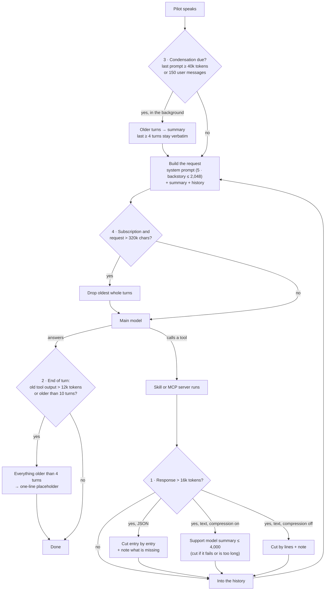

# What Wingman AI shortens, and when

A conversation with a Wingman grows with every turn: the pilot's words, the
answers, and above all tool responses (a UEX price table, a web page from an MCP
server). The main model is billed for everything it is sent on every call, and
every model and our backend have a size limit. So Core shortens content in a few
places. This page lists every one of them, what triggers it, and what the log
says when it happens.

Every shortening writes a line to the log file. The ones that change what the
main model sees in the conversation are also shown in the client.

## The short version

| # | Where | Trigger | What happens | Switch |
|---|---|---|---|---|
| 1 | A tool response comes in | Over the cap: 16,000 tokens (`skill_max_input_tokens`; fixed on the subscription) | JSON is cut entry by entry, text is summarized by the support model or cut by lines | `compress_tool_responses` (summary vs. cut) |
| 2 | End of every turn | Tool responses older than 4 turns add up to more than 12,000 tokens, or one is older than 10 turns | Everything older than 4 turns is replaced by a one-line placeholder | `condense_conversation` |
| 3 | Start of a turn | Last prompt ≥ 40,000 tokens (cloud support model), or history ≥ 70% of what a local support model can read, or 150 user messages | Older messages become a running summary; the last 8,000 tokens, at least 4 turns, stay word for word | `condense_conversation` |
| 4 | Before every call to the main model | Subscription only: request over 320,000 characters of JSON | The oldest whole turns are removed | none (safety net) |
| 5 | Building the system prompt | Backstory over 2,048 tokens | The prompt uses the first 2,048 tokens | none |
| 6 | A skill calls `ai.generate` | Input over the same cap as 1, only with condensation on | `FacadeError`, or cut with `auto_shorten=True` | `condense_conversation` |
| 7 | A skill calls `local_ai.summarize` | Input over what the support model reads at once | Chunked summary; very large inputs keep only the start | none |
| 8 | Any support model call | Input over the support model's window | The end of the input is cut | none |

Not counted as shortening: the filler line and memory extraction cut their own
inputs to a small fixed size (a 200-token request, a 150-token excerpt). They
shape a prompt; nothing leaves the conversation.

## One turn, step by step

Skills have two more doors (6 and 7), outside the conversation: a side-call to
the main model and a summary on the support model. Neither result enters the
history unless the skill returns it as its tool response, and then it passes
through 1 like any other.

## The places in detail

### 1 · A tool response comes in

`services/tool_executor.py` → `ToolResponseLimiter` (`services/tool_response_limiter.py`).

Every skill tool and every MCP tool passes here. Under the cap nothing is
touched. Over it:

- **JSON** (a list or an object) is always cut, never summarized: whole entries
  in the skill's own order, until the cap, plus a note on how many are missing.
  A summary of a price table copied the first rows until its budget ran out; the
  cut keeps them verbatim and costs nothing.
- **Text** is summarized by the support model when `compress_tool_responses` is
  on and a support model is ready: at most 4,000 tokens, thrown away if it comes
  out at 75% of the cap or more. If the text is longer than the support model
  reads in one call, a small local model cuts instead, a cloud model summarizes
  the start.
- Otherwise text is cut by whole lines, plus a note.

The cap is `features.skill_max_input_tokens` (default 16,000) on an own
provider and a fixed 16,000 on the Wingman subscription.

Log: *"Tool response from 'x' has ~N tokens, above the limit of ~16,000"*, then
*"Tool response summarized (~N → ~M tokens)"* or *"Tool response cut to …"*.

### 2 · Old tool responses are cleared

`ConversationManager.trim_tool_responses`, after every turn.

- The tool responses of the last 4 user turns (`KEEP_TOOL_TURNS`) are never
  touched: "which of those is cheapest?" or "add a stop to the table" a few
  messages later needs the real data.
- Older ones stay until they add up to more than 12,000 tokens or one is more
  than 10 turns old. Then everything older than 4 turns is replaced in one pass
  by *"[Tool output removed from history (~N tokens from tool). Call the tool
  again if it is needed.]"*.
- In batches because rewriting a message breaks the provider's prompt cache from
  that message on. One batch every few turns is cheaper than one rewrite per
  turn.
- The tool **call** stays, with its arguments. A HUD table the Wingman wrote
  itself is therefore still in the history after its response is cleared.
- With `condense_conversation` off, nothing is cleared.

Log: *"Removed N tool responses older than 4 turns from the history (~T tokens):
tool ×2, other. The tool data of the last 4 turns stays complete."*

### 3 · The conversation is condensed

`ConversationCondenser` (`services/conversation_condenser.py`), checked when a
user message arrives, run in the background.

- Trigger on a cloud support model: the previous request to the main model was
  40,000 tokens or more. On a local support model: the history reaches 70% of
  what it can summarize in one pass (a few thousand tokens). On both: 150 user
  messages.
- It only runs if it frees at least 4,000 tokens, unless the 150-message cap fired.
- Kept word for word: the last 8,000 tokens (`condense_keep_recent_tokens`,
  at most a third of what the support model reads), and never fewer than the
  last 4 turns, so it cannot summarize away what 2 keeps.
- Everything before becomes part of a running summary, which goes into the
  system prompt. A tool call and its response are never split.
- `/condense` in the chat runs it by hand and keeps only the latest turn.
- If a part is too long for the support model, it is cut before summarizing, and
  the log says so: that part is not in the summary.

Log: *"Conversation condensed: N older messages (~T tokens) became a summary of
~S tokens. M recent messages (~R tokens) kept verbatim."*

### 4 · The subscription's size limit

`Wingman._fit_subscription_request`, before every call to the main model.

The backend refuses a conversation over 400 KB of JSON, about 100,000 tokens.
With condensation on this is never reached. With it off nothing else shortens
the history, so at 320,000 characters the oldest whole turns go until the
request fits. The latest turn always stays. Own providers are left alone: their
limit is the model's context window, which Core does not know.

Log: *"The conversation reached the size limit of the Wingman subscription. The
N oldest messages were removed from the history."*

### 5 · The backstory

`ContextBuilder`: a backstory over 2,048 tokens is cut for the prompt. The saved
backstory is not changed. The client does not allow longer ones; this catches
configs edited by hand.

### 6 · A skill asks the main model: `ai.generate`

`SkillAi.generate` (`wingmen/facade.py`). A one-off call, outside the
conversation. With condensation on, its input (system + prompt + data + a flat
1,000 tokens per image) is capped like 1. Over the cap it raises `FacadeError`,
unless the skill passed `auto_shorten=True`: then the prompt is cut to fit and
the log says so.

### 7 · A skill asks the support model: `local_ai.summarize`

`SkillLocalAi.summarize`. Fits in one call → one call. Too big → the text is
split into chunks of about 400 tokens and summarized in batches; over 100 chunks
(about 40,000 tokens) only the first 800 tokens are kept, and of smaller texts
at most 30 chunks are summarized. `summarize_sync` cuts to the window instead.
Every cut is in the log.

### 8 · Any support model call

`LocalAiService.support`: input longer than the support model's window minus
the room for its answer is cut at the end. This protects memory extraction,
summaries and the filler line from a failed call. Log (server only): *"Support
model input cut from ~N to ~M tokens"*.

## Scenarios

The numbers are rounded; tokens are counted with `cl100k_base`.

### A · A plain conversation

Twenty turns of small talk and ship commands, no tools. Each turn adds maybe 100
tokens. Nothing is shortened: 1 and 2 have no tool responses to work on, and 3
needs a 40,000-token prompt, which a system prompt plus 2,000 tokens of history
does not reach.

### B · Trading with UEX and the HUD

Played through the real `trim_tool_responses` with these sizes:

1. Turn 1, "Where do I buy Laranite?" → `uex_get_commodity_information` returns
   1,400 tokens of JSON. Under the cap (1), stored as it is.
2. Turn 2, "Put a trade route table on the HUD." → `hud_add_info` with the table
   as its argument. The call and its arguments stay in the history for good;
   only its short response ("Added/Updated info panel") can be cleared.
3. Turns 3 to 8: Agricium and Titanium, Gold, Medical Supplies, Stims, Tungsten
   routes, another table edit. Responses of 1,200 to 3,300 tokens.
4. Turn 9, "how much stock did ArcCorp 056 have?" → the Laranite response is 8
   turns old, older than 4, but the old responses (turns 1 to 5) add up to about
   6,300 tokens, under 12,000. It is still there, the answer is exact.
5. End of turn 11: the responses older than 4 turns (turns 1 to 7) now add up to
   more than 12,000 tokens. All seven are replaced in one pass. Log: *"Removed 7
   tool responses older than 4 turns from the history (~11,938 tokens):
   uex_get_commodity_information ×5, hud_add_info ×2. The tool data of the last 4
   turns stays complete."* Tool data in the history drops from about 13,300 to
   1,400 tokens.
6. Turn 12, Scrap and Processed Food: 7,500 tokens in one response. It is fresh
   and stays complete for the next 4 turns.
7. Turn 15, "what was the Laranite price again?" → the Laranite data is a
   placeholder now. The model calls the tool again, or reads the price from the
   HUD table in its own `hud_add_info` arguments.

The prompt peaks around 30,000 tokens (measured in `evals/history_bench`).
Condensation (3) has not started.

### C · A 60,000-token web page from an MCP server

A search tool returns a page of plain text, 60,000 tokens. Over the cap (1):

- Compression on, cloud support model → the support model summarizes it into at
  most 4,000 tokens, marked *"[SUMMARY OF A TOOL RESPONSE — the original had
  ~60,000 tokens …]"*. The pilot waits about 10 seconds for this.
- Compression off → the first 16,000 tokens by whole lines, plus a note that the
  rest is missing.
- Local support model with a 4,096-token window → too small to summarize this in
  one call, so it is cut like with compression off.

If the same tool had returned JSON, it would have been cut entry by entry in all
three cases.

### D · A long evening with condensation on

After about two and a half hours of play the prompt reaches 40,000 tokens. When
the pilot speaks next, condensation starts in the background: everything but
the last 8,000 tokens, and at least the last 4 turns, becomes a summary of a few
hundred tokens. The next prompt is the system prompt and tool definitions plus
about 8,000 tokens of history. The client shows the summary under "Show
history". Tool responses cleared by 2 before that are
summarized as their placeholders: the summary knows the tool was called, not
what it returned.

### E · Condensation off, on the subscription

The pilot turned "Auto-summarize conversations" off. Nothing is cleared (2) or
summarized (3). Each turn costs more of the allowance, because the whole history
is sent every time. After a very long session, with large tool responses, the
request reaches 320,000 characters: the oldest turns are dropped (4) until it
fits, and the chat says so. Without this the backend would refuse every further
request with "The conversation is too large".

On an own provider the same session runs until the model's context window is
full; then the provider returns an error. Core does not shorten anything there.

### F · A skill writes a radio message: `ai.generate`

Radio Chatter builds a prompt of 20,000 tokens and calls `ai.generate(...,
auto_shorten=True)`. Condensation is on, the cap is 16,000 → the prompt is cut
to fit (6), the log says so, the call goes through. Without `auto_shorten` the
skill would get a `FacadeError` and has to shorten the input itself. With
condensation off there is no cap here.

### G · A skill summarizes a manual: `local_ai.summarize`

A skill passes a 30,000-token PDF text to `local_ai.summarize`. The cloud
support model reads it in one call. A local model with a 4,096-token window
does not: the text is split into 75 chunks of about 400 tokens, the first 30 are
summarized in batches, the other 45 are left out, and the result carries a note
that it covers the first part only (7).
