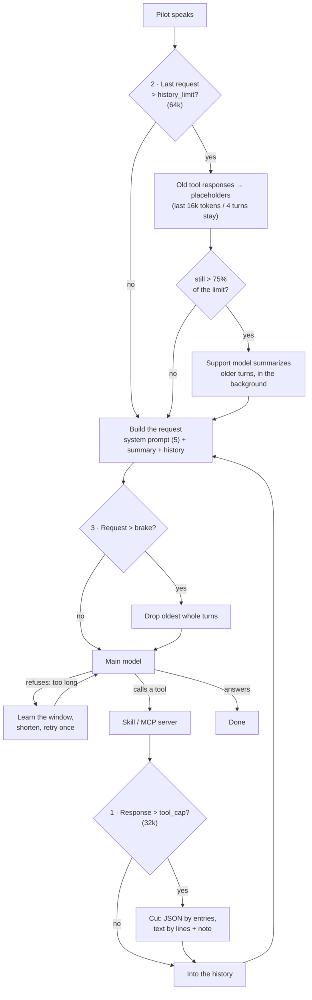

# What Wingman AI shortens, and when

A conversation with a Wingman grows with every turn: the pilot's words, the
answers, and above all tool responses (a UEX price table, a web page from an MCP
server). Every model has a context window it cannot exceed, and on the
subscription every token counts against the user's allowance. So Core shortens
content in a few places. This page lists all of them.

Every shortening writes a line to the log file. The ones that change what the
main model sees are also shown in the client.

## One budget, from the main model's window

All limits come from `services/context_budget.py`. Each is the smaller of an
absolute ceiling, which protects the allowance from a skill that returns half a
million tokens, and a share of the main model's context window, which keeps a
small model from being sent more than it can read.

| Limit | Value | What it guards |
|---|---|---|
| `tool_cap` | min(32,000, 25% of the window) | one tool response, one `ai.generate` input |
| `history_limit` | min(64,000, 50% of the window) | below it the history is never touched |
| `keep_tokens` | 25% of `history_limit`, at least the last 4 turns | what stays word for word when the history is shortened |
| `brake` | 90% of the window; on the subscription also 320,000 characters | the largest request Wingman sends |

The window comes from, in this order:

1. what the Wingman learned from a refused request (see the brake below);
2. what the provider reports (OpenRouter: the smallest window among the model's
   endpoints);
3. a table of known models (`gpt-4.1` 1M, `gemini` 1M, `claude` 200k, …);
4. 128,000, or 32,000 for a local LLM.

The support model's window plays no part in these limits. It reads whatever it
is given in chunks that fit its own window.

One switch: **Auto-summarize conversations** (`features.condense_conversation`).

## The places

| # | Where | When | What happens |
|---|---|---|---|
| 1 | A tool response comes in | over `tool_cap` | JSON is cut entry by entry, text at a line, with a note on what is missing |
| 2 | Start of a turn | the last request passed `history_limit` (switch on) | old tool responses become placeholders; if that is not enough, older turns are summarized |
| 3 | Before every call to the main model | the request is over `brake` | the oldest whole turns go |
| 4 | A skill calls `ai.generate` | its input is over `tool_cap` | `FacadeError`, or cut with `auto_shorten=True` |
| 5 | Building the system prompt | backstory over 2,048 tokens | the prompt uses the first 2,048 tokens |
| 6 | A skill calls `local_ai.summarize` | input over what the support model reads at once | summarized in chunks; very large input keeps only its start |
| 7 | Any support model call | input over the support model's window | the end of the input is cut |

Not counted: the filler line and memory extraction cut their own inputs to a
small fixed size. Nothing leaves the conversation there.

## One turn, step by step

## The places in detail

### 1 · A tool response comes in

`services/tool_executor.py` → `ToolResponseLimiter` (`services/tool_response_limiter.py`).

Every skill tool and every MCP tool passes here. Under `tool_cap` nothing is
touched. Over it:

- **JSON** keeps whole list entries or whole keys, in the skill's own order,
  until the cap, plus a note how many are missing.
- **Text** is cut at a line boundary, plus a note.

There is no summary. Measured on 62,000 tokens of real prose with three facts in
it (`evals/FINDINGS-context-budget-2026-09-28.md`): the support model's summary
kept none of them and made the pilot wait 25 seconds; the cut at 32,000 kept
two.

Log: *"Tool response from 'x' has ~N tokens, above the limit of ~32,000"*, then
*"Tool response cut to 445 of 25000 entries (~N → ~M tokens)"*.

### 2 · The history passes its limit

`ConversationCondenser.maybe_condense` (`services/conversation_condenser.py`),
when a user message arrives. Only with **Auto-summarize conversations** on.

- Below `history_limit` nothing happens. Every tool response, every turn, word
  for word. A price from twenty turns ago is still exact.
- Above it, first the cheap step: tool responses older than the kept part
  (`keep_tokens`, at least the last 4 turns) become *"[Tool output removed from
  history (~N tokens from tool). Its numbers and details are no longer here:
  call the tool again before stating any of them.]"*. No model call. The tool
  **call** stays with its arguments, so a HUD table the Wingman wrote is still
  there.
- Only if the request would still be over three quarters of the limit, the
  support model summarizes the older turns, in the background, in chunks that
  fit its window. The summary goes into the system prompt. A tool call and its
  response are never split.
- `/condense` in the chat summarizes by hand and keeps only the latest turn.

Why the limit is 64,000 and why nothing happens below it: with the old rules
(tool output cleared after 4 turns and 12,000 tokens) gpt-4.1-mini answered 4 of
10 questions about data 3 to 36 turns old and invented a price or stock 3 times;
with the history left alone it answered 8 and invented nothing. It rarely calls
the tool again once the data is gone. A normal trading session costs the same
either way, because an untouched history is cached; a long tool-heavy evening
about twice as much.

Log: *"The conversation passed its size limit. Removed N older tool responses
from the history (~T tokens): tool ×2, other."*, and for a summary
*"Conversation condensed: N older messages (~T tokens) became a summary of ~S
tokens …"*.

### 3 · The brake

`Wingman._fit_request`, before every call to the main model.

If a request is over `brake`, the oldest whole turns are dropped until it fits;
the latest turn always stays. On the subscription the request must also stay
under 320,000 characters: the backend refuses anything over 400 KB. With the
switch on, 2 keeps requests far below this. With it off, this is the only thing
that shortens the history.

If the model still refuses a request as too long ("context length exceeded"),
the Wingman takes three quarters of that request as the model's window, shortens
to it, and retries once. The learned window lasts until the config changes. This
is how a local model with an unknown small window finds its limit without any
setting.

Log: *"The conversation reached what the model can take (~N tokens). The M
oldest messages were removed from the history."* and *"The model refused a
request of ~N tokens as too long … Wingman now assumes a window of ~M tokens"*.

### 4 · A skill asks the main model: `ai.generate`

`SkillAi.generate` (`wingmen/facade.py`). A one-off call outside the
conversation. Its input (system + prompt + data + 1,000 tokens per image) is
capped at `tool_cap`, whatever the switch says. Over it: `FacadeError`, or the
prompt is cut with `auto_shorten=True`, and the log says so.

### 5 · The backstory

`ContextBuilder`: a backstory over 2,048 tokens is cut for the prompt. The saved
one is not changed.

### 6 · A skill asks the support model: `local_ai.summarize`

`SkillLocalAi.summarize`. Fits in one call → one call. Too big → split into
chunks of about 400 tokens and summarized in batches; over 100 chunks only the
first 800 tokens are kept, of smaller texts at most 30 chunks are summarized.
`summarize_sync` cuts to the window instead. Every cut is logged.

### 7 · Any support model call

`LocalAiService.support`: input longer than the support model's window minus
room for its answer is cut at the end. Log (server only): *"Support model input
cut from ~N to ~M tokens"*.

## Scenarios

### A · A plain conversation

Twenty turns of small talk and ship commands. Nothing is shortened: no tool
responses, and the history is nowhere near 64,000 tokens.

### B · Trading with UEX and the HUD

Twenty-five turns: prices for Laranite, Agricium, Titanium, Gold and more, a
trade route table on the HUD, edits to it. The request peaks around 14,000
tokens. Nothing is cleared. Turn 17 asks for the Titanium demand from turn 3
and gets the exact number.

### C · A long, tool-heavy evening

Fifty turns, a new commodity in almost every one. The request grows to about
40,000 tokens and stays under the limit, so nothing is cleared and every old
price is still there. With a smaller model, say 64,000 tokens of window, the
limit is 32,000: when a request passes it, the tool responses older than the
last 8,000 tokens (at least 4 turns) become placeholders at the start of the
next turn, in one pass.

### D · A 60,000-token web page from an MCP server

Over `tool_cap`: the first 32,000 tokens stay, cut at a line, with a note that
the rest is missing. No waiting for a summary. A fact near the end of the page
is lost; the note tells the model to ask the tool for less.

### E · A skill that dumps 870,000 tokens every call

Cut to 32,000 tokens (a few hundred of its 25,000 JSON entries) every time,
with a warning in the client. On gpt-4.1-mini that is about 1.3 cents per call.

### F · A local model with an 8,000-token window

The table does not know it, so the Wingman assumes 32,000 for a local LLM:
`tool_cap` 8,000, `history_limit` 16,000. The first request over 8,000 tokens
is refused; the Wingman learns a window of three quarters of that request,
drops the oldest turns and retries. From then on the limits follow the learned
window.

### G · Auto-summarize off, on the subscription

Nothing is cleared or summarized. Every turn sends the whole history, which
costs more allowance on long sessions. When a request reaches 320,000
characters, the oldest turns go and the chat says so.
